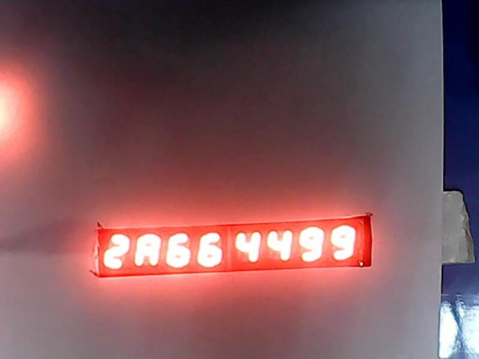
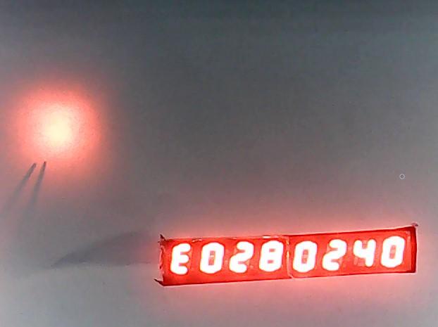
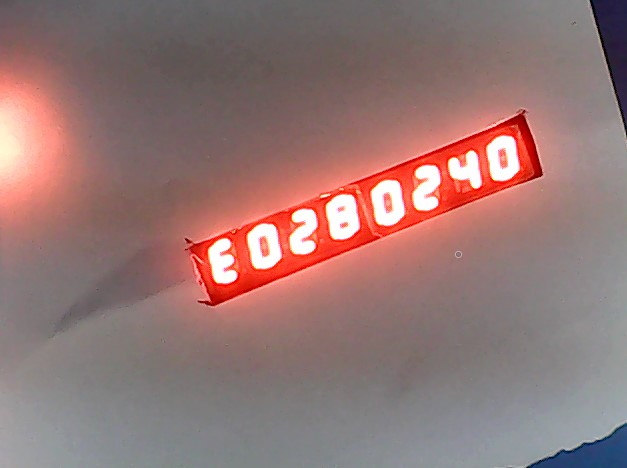
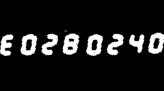
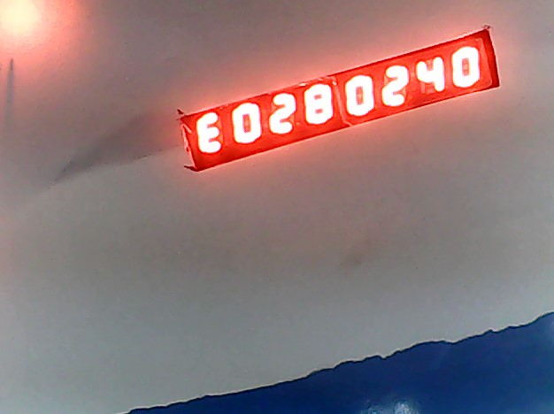
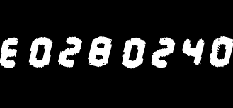
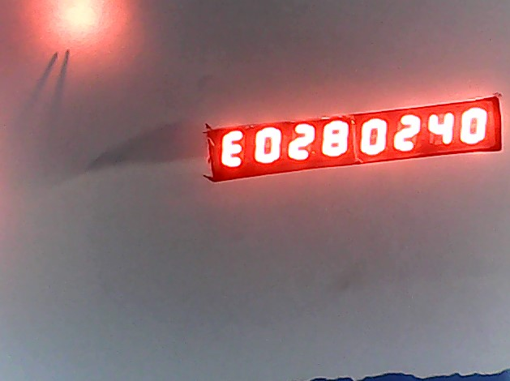
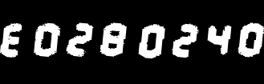

# 关于测试图片
## 以raw_2开头的图片为实验室摄像头获取的，仅对这些做测试

#
## 测试记录raw_20

* 截取的数字区域
  * 
* 图片内容应为 
  * _2 A 6 6 4 4 9 9_
* 识别为
  * ['2', 'A', '6', '6', '4', '4', '9', '9']
---

## 测试记录raw_21

* 截取的数字区域
  * 
* 图片内容应为 
  * E 0 2 8 0 2 4 0
* 识别为
  * ['E', '0', '2', '8', '0', '2', '4.', '0']
* 4.:
  * 
---

## 测试记录raw_22

* 截取的数字区域
  * 
* 图片内容应为 
  * E 0 2 8 0 2 4 0
* 识别为
  * ['E', '0', '2', '8', '0', '2', '4', '0']
---

## 测试记录raw_23

* 截取的数字区域
  * 
* 图片内容应为 
  * E 0 2 8 0 2 4 0
* 识别为
  * ['E', '0', '2', '8', '0', '2', '4', '0']
---

## 测试记录raw_24

* 截取的数字区域
  * 
* 图片内容应为 
  * E 0 2 8 0 2 4 0
* 识别为
  * ['E', '0', '2', '8', '0', '2', '4', '0']

